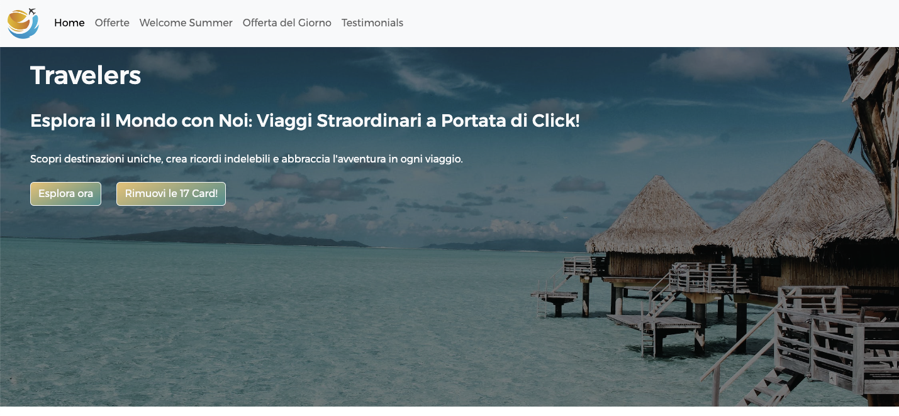

### Creare  un  sito di viaggi.

1. Implementa una Navbar
2. Aggiungi un logo alla Navbar
3. Aggiungi una sezione Jumbotron
4. Sezione Offerta della Settimana
5. Sezione Welcome Summer
6. Sezione Offerta del Giorno
7. Sezione Last-Minute
8. Sezione Testimonial
9. Footer

# Screenshot Sito

